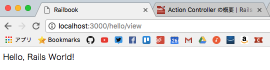

ビューについて
===
Model-View-Controllerの考えから、今までやってきたことは序の口です。最終的な出力には、 *ERB(Embedded Ruby)* テンプレートを利用するのが基本です。
ERBテンプレートは、一言でいならばHTMLにRubyスクリプトを埋め込む(embed)のための仕組みです。

#### メリット
- 任意のRubyスクリプトを埋め込めるので、条件分岐や繰り返し構文などの処理も自由に記述できる。
- ビューヘルパーを利用することで、データベースから取得した値に基づいたリンクやフォーム要素などをシンプルなコードを生成できる

Railsでは、その他にもBuilder、Jbuilderのようなテンプレートエンジンを利用できる。

#### テンプレート変数の設定
前と同じく「Hello, Rails World!」というメッセージを表示するサンプルです。
今回はコントローラークラスから直接に文字列を出力するのではなく、テンプレートファイルを経由してから生成します。

```rb
class HelloController < ApplicationController
    def index
        render plain: 'Hello, Rails World!'
    end

    def view
        @msg = 'Hello, Rails World!'
    end
end
```

*テンプレート変数* とは、テンプレートファイルに埋め込むべき値のことで、アクションメソッドとビューでデータを受け渡しするための橋渡し役となるものです。
Railsでテンプレート変数の役割を担うのは、インスタンス変数です。サンプルの例ではインスタンス変数として@msgを設定していますが、これがそのままテンプレート上でも自由に参照できる変数となるわけです。
viewアクションではインスタンス変数@msg の1つに文字列を設定しているだけですが、もちろん複数の変数を設定することも出来ますし、値には文字列だけでなく、配列や任意のオブジェクトを設定することも可能です。

#### テンプレートファイルの作成
アクションの結果を出力するためのテンプレートファイルを作成します。テンプレートファイルを作成します。

```html
<div id="main">
<%= @msg %>
</div>
```

動的な処理は`<%...%>`や`<%=...%>`で記述する

前者がブロックの中のコードをただ実行するだけであるのに対して、後者は与えられた式を出力します。

```html
<div><%
price = 1000
result = price * 1.05
%></div>

<div>$<%= result %></div>
```

#### サンプルの実行
以上のことをすれば、routes.rbにルート定義を追加するだけです。

```rb
Rails.application.routes.draw do
  # For details on the DSL available within this file, see http://guides.rubyonrails.org/routing.html
  get 'hello/index', to: 'hello#index'
  get 'hello/view'
end
```

「http://localhost:3000/hello/view 」にアクセス。
